# EmuPipeline v5.0

> **Pipeline Python 3.10+ modular para padronização, organização e otimização de bibliotecas de emulação**
> Plataforma alvo: Bazzite / Linux · EmuDeck · Steam Deck · FBNeo / MAME Arcade

[](https://github.com/rtasistemas/evs/actions)
[](https://python.org)
[](LICENSE)
[](#6-steps-do-pipeline)
[](#10-testes)

---

## Índice

1. [Visão Geral](#1-visão-geral)
2. [Arquitetura do Sistema](#2-arquitetura-do-sistema)
3. [Fluxo do Pipeline](#3-fluxo-do-pipeline)
4. [Requisitos e Instalação](#4-requisitos-e-instalação)
5. [Configuração — config.yaml](#5-configuração--configyaml)
6. [Steps do Pipeline](#6-steps-do-pipeline)
7. [Módulos Core](#7-módulos-core)
8. [Modos de Execução](#8-modos-de-execução)
9. [CLI — Interface de Linha de Comando](#9-cli--interface-de-linha-de-comando)
10. [Testes](#10-testes)
11. [Troubleshooting](#11-troubleshooting)
12. [Glossário](#12-glossário)

---

## 1. Visão Geral

O **EmuPipeline** automatiza todas as etapas para montar uma biblioteca de emulação organizada, padronizada e otimizada — do DAT XML bruto até o `gamelist.xml` pronto para o EmulationStation.

### O problema que resolve

```
ANTES                              DEPOIS
─────────────────────────          ─────────────────────────────────
ROMs espalhadas sem padrão    →    ROMs organizadas por driver/sistema
Imagens com nomes variados    →    Imagens renomeadas e linkadas ao ROM
PNGs pesados e lentos         →    WebP otimizado (≈70% menor)
Vídeos sem codec padrão       →    H.265/H.264 com smart-skip
Sem gamelist.xml              →    gamelist.xml para EmulationStation
Launchers de ports manuais    →    .desktop automático com gamemode/wine
```

### Capacidades principais

| Capacidade | Tecnologia |
|---|---|
| Organização de ROMs | IGIR + DAT XML |
| Match de imagens | Fuzzy search (bigram + SequenceMatcher) |
| Conversão de imagens | Pillow (ProcessPool — bypassa GIL) |
| Upscaling | waifu2x / Real-ESRGAN + ImageMagick |
| Otimização de vídeo | ffmpeg + ffprobe smart-skip |
| Metadados | gamelist.xml EmulationStation |
| Ports/Launchers | .desktop + autorun.sh (Linux/Wine) |
| Execução segura | DRY_RUN / AUDIT sem I/O real |
| Atomicidade | StagingTransaction (sem arquivos corrompidos) |

---

## 2. Arquitetura do Sistema

### 2.1 Visão de camadas

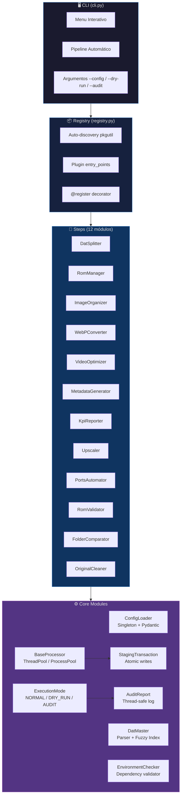

### 2.2 Diagrama de classes principal

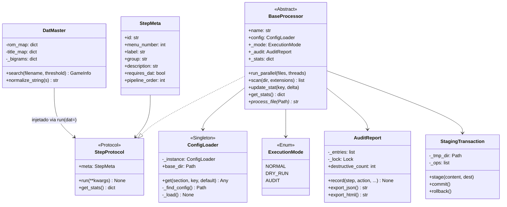

### 2.3 Sistema de Registry e plugins

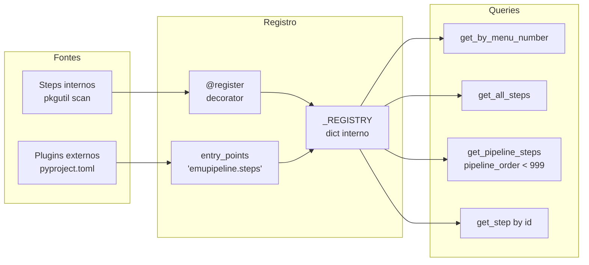

---

## 3. Fluxo do Pipeline

### 3.1 Pipeline automático (ordem de execução)

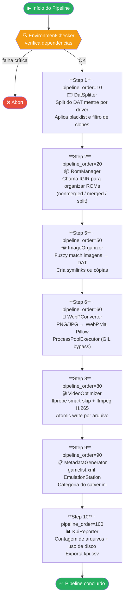

### 3.2 Steps manuais (excluídos do pipeline automático)

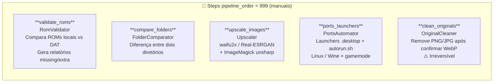

### 3.3 Fluxo de dados de imagens

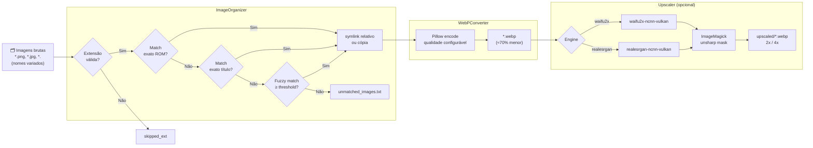

### 3.4 Fluxo de otimização de vídeo

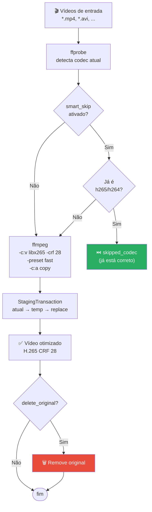

---

## 4. Requisitos e Instalação

### 4.1 Dependências Python

```bash
pip install emupipeline                  # mínimo
pip install emupipeline[images]          # + Pillow (WebP)
pip install emupipeline[validation]      # + Pydantic v2
pip install emupipeline[kpi]             # + pandas, openpyxl
pip install emupipeline[all]             # tudo
```

### 4.2 Ferramentas externas

| Ferramenta | Versão mínima | Usado por | Obrigatório |
|---|---|---|---|
| Python | 3.10 | tudo | ✅ |
| ffmpeg | qualquer | VideoOptimizer | apenas vídeo |
| ffprobe | qualquer | VideoOptimizer smart-skip | apenas vídeo |
| igir | 1.8+ | RomManager | apenas ROMs |
| ImageMagick | 7+ (`magick`) | Upscaler pós-proc | opcional |
| waifu2x-ncnn-vulkan | qualquer | Upscaler | opcional |
| realesrgan-ncnn-vulkan | qualquer | Upscaler | opcional |

### 4.3 Instalação rápida

```bash
# Clone
git clone https://github.com/rtasistemas/evs.git
cd evs

# Instale em modo editável (desenvolvimento)
pip install -e ".[all]"

# Copie e ajuste o config de exemplo
cp config.yaml.example config.yaml
$EDITOR config.yaml

# Verifique o ambiente
emupipeline --check-env

# Execute o pipeline completo
emupipeline --pipeline
```

---

## 5. Configuração — config.yaml

### 5.1 Estrutura de seções

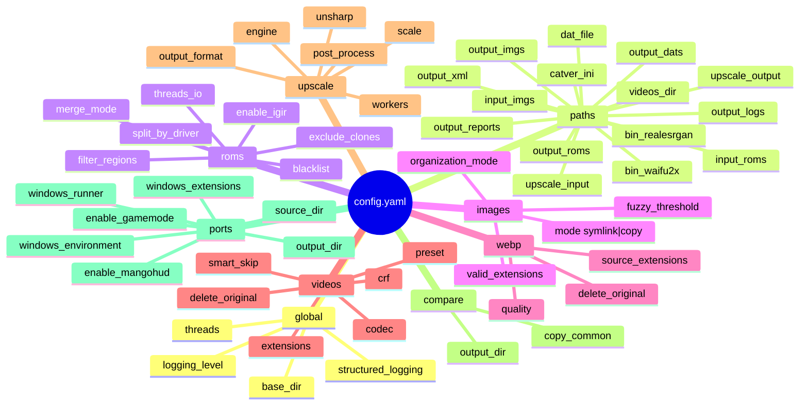

### 5.2 config.yaml completo comentado

```yaml
global:
  base_dir: ~/emupipeline        # raiz — todos os paths relativos resolvem aqui
  logging_level: INFO            # DEBUG | INFO | WARNING | ERROR
  threads: 4                     # workers padrão (1-64)
  structured_logging: false      # true → JSON lines para ingestão em log system

paths:
  dat_file: ./FBNeo.dat          # DAT XML mestre (FBNeo, MAME, Redump…)
  catver_ini: ./catver.ini       # Categorias de jogos (usado em gamelist.xml)
  input_roms: ~/roms_input       # ROMs brutas (fonte)
  input_imgs: ~/images_input     # Imagens brutas (fonte)
  output_roms: ~/roms_organized  # ROMs após IGIR
  output_imgs: ~/images_organized
  output_xml: ~/gamelist.xml
  output_dats: ~/dats_split      # DATs por driver gerados pelo DatSplitter
  output_reports: ~/reports
  output_logs: ~/logs
  videos_dir: ~/videos
  upscale_input: ~/images_organized   # entrada do upscaler
  upscale_output: ~/images_upscaled   # saída do upscaler
  bin_waifu2x: /opt/waifu2x/waifu2x-ncnn-vulkan
  bin_realesrgan: /opt/realesrgan/realesrgan-ncnn-vulkan

roms:
  enable_igir: true
  split_by_driver: true          # divide DAT por sourcefile (driver)
  merge_mode: nonmerged          # nonmerged | merged | split
  filter_regions: "WORLD,USA"    # regiões mantidas; vazio = todas
  exclude_clones: true           # remove jogos com <cloneof>
  generate_bios_file: false      # inclui entradas de BIOS
  blacklist:                     # ROMs cujo driver contém esses termos são removidos
    - adult
    - mahjong
    - quiz
  threads_io: 4                  # threads do IGIR

images:
  mode: symlink                  # symlink | copy
  organization_mode: subfolders  # subfolders (por driver) | flat
  overwrite: false
  fuzzy_threshold: 0.80          # [0.0-1.0] precisão do match fuzzy
  valid_extensions:
    - .png
    - .jpg
    - .jpeg
    - .gif
    - .webp

webp:
  quality: 85                    # [1-100]
  delete_original: false         # use step clean_originals para deletar
  source_extensions:
    - .png
    - .jpg

videos:
  codec: libx265                 # libx265 | libx264
  crf: 28                        # [0-51] qualidade (menor = melhor)
  preset: fast                   # ultrafast|superfast|veryfast|faster|fast|medium|slow
  delete_original: false
  smart_skip: true               # pula vídeos já no codec correto
  extensions:
    - .mp4
    - .avi
    - .mkv

upscale:
  engine: waifu2x                # waifu2x | realesrgan
  scale: 2                       # 2 | 4
  output_format: webp
  workers: 2                     # processos paralelos do binário
  post_process: true             # aplica unsharp mask via ImageMagick
  unsharp: "0x1.0+1.0+0.02"     # parâmetro -unsharp do ImageMagick

compare:
  output_dir: output/common_files
  copy_common: false

ports:
  source_dir: ~/ports            # cada subdir é um port
  output_dir: ~/ports_launchers  # destino dos .desktop
  windows_runner: wine           # wine | proton | bottles
  enable_gamemode: false         # prefixar com gamemoderun
  enable_mangohud: false         # prefixar com mangohud
  windows_extensions:
    - .exe
    - .bat
  windows_environment: {}        # WINEPREFIX etc.
```

### 5.3 Resolução de configuração

```mermaid
flowchart LR
    ENV_VAR["$EMUPIPELINE_CONFIG\n(env var)"]
    CWD["./config.yaml\n(diretório atual)"]
    PKG["config.yaml\n(raiz do pacote)"]
    ERR["FileNotFoundError"]

    ENV_VAR -- existe --> LOAD[ConfigLoader.\_load]
    ENV_VAR -- não existe --> CWD
    CWD -- existe --> LOAD
    CWD -- não existe --> PKG
    PKG -- existe --> LOAD
    PKG -- não existe --> ERR

    LOAD --> PYDANTIC{Pydantic v2\ndisponível?}
    PYDANTIC -- Sim --> VAL[Validação completa\ncom tipos e limites]
    PYDANTIC -- Não --> FALLBACK[Validação manual\nmínima]
    VAL & FALLBACK --> SINGLETON[cfg = ConfigLoader()\nSingleton global]
```

---

## 6. Steps do Pipeline

### 6.1 Mapa completo de steps

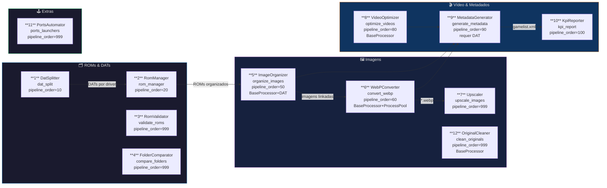

---

### 6.2 Step 1 — DatSplitter

**Classe:** `DatSplitter` · **ID:** `dat_split` · **Grupo:** ROMs & DATs · **Menu:** 1

Lê o DAT XML mestre e gera um arquivo `.dat` separado por driver de hardware (ex: `capcom.dat`, `snk.dat`). Aplica filtros configuráveis antes de gravar.

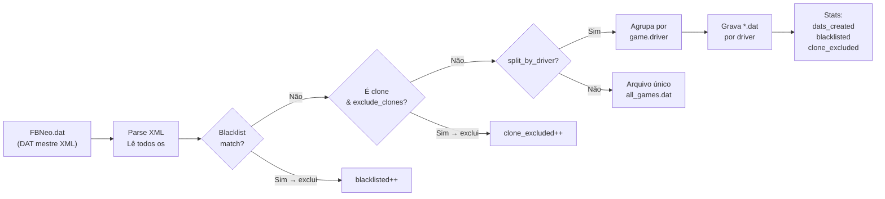

**Configuração relevante:** `roms.split_by_driver`, `roms.blacklist`, `roms.exclude_clones`, `roms.generate_bios_file`

---

### 6.3 Step 2 — RomManager

**Classe:** `RomManager` · **ID:** `rom_manager` · **Grupo:** ROMs & DATs · **Menu:** 2

Invoca o **IGIR** para verificar, renomear e organizar ROMs contra os DATs gerados pelo DatSplitter. Suporta os três modos de merge do MAME.

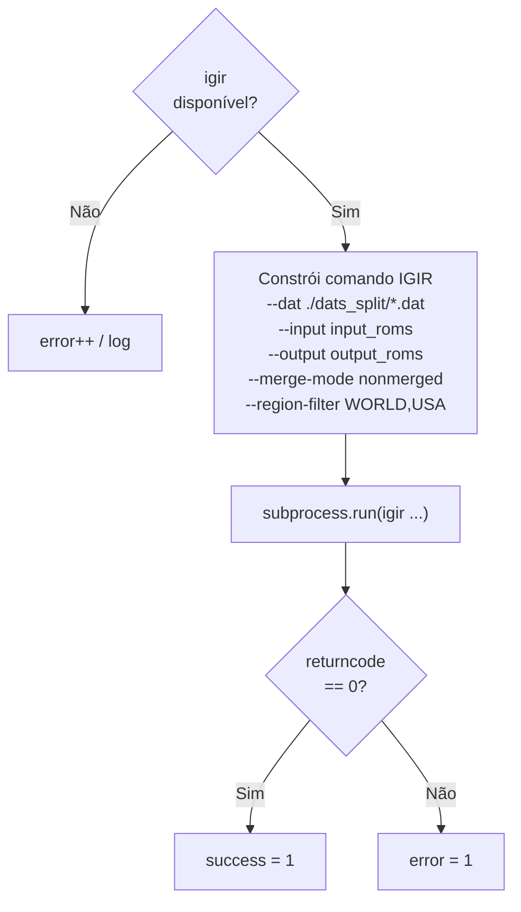

**Modos de merge:**

| Modo | Descrição |
|---|---|
| `nonmerged` | Cada ROM é um arquivo completo independente |
| `merged` | Parent contém todos os clones dentro |
| `split` | Clones contêm apenas os arquivos diferentes do parent |

---

### 6.4 Step 5 — ImageOrganizer

**Classe:** `ImageOrganizer` · **ID:** `organize_images` · **Grupo:** Imagens · **Menu:** 5

Associa imagens de nomes variados aos ROMs correspondentes no DAT usando três camadas de match progressivo. Cria **symlinks relativos** ou **cópias** na pasta organizada.

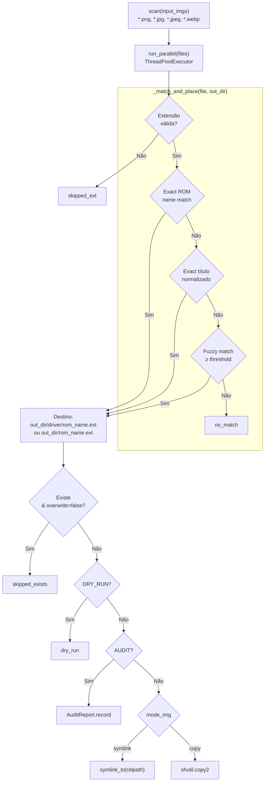

**Normalização para fuzzy match:**
- Remove tags de região: `(USA)`, `[!]`, `(Europe)` etc.
- Lowercase + ASCII-safe
- Remove pontuação e espaços extras
- Índice de bigramas para pré-filtrar candidatos em O(1)

---

### 6.5 Step 6 — WebPConverter

**Classe:** `WebPConverter` · **ID:** `convert_webp` · **Grupo:** Imagens · **Menu:** 6

Converte PNG/JPG em WebP usando Pillow com **ProcessPoolExecutor** (bypassa o GIL do Python para conversão real em paralelo).

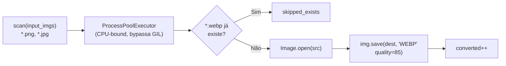

> **Por que ProcessPool?** Pillow é CPU-bound (compressão de imagem). O GIL do CPython impede paralelismo real com threads — o ProcessPool resolve isso criando processos separados.

---

### 6.6 Step 7 — Upscaler

**Classe:** `Upscaler` · **ID:** `upscale_images` · **Grupo:** Imagens · **Menu:** 7

Aumenta a resolução de imagens 2× ou 4× usando redes neurais. Pós-processa com **ImageMagick unsharp mask** para nitidez. Robusto: erros por imagem são logados individualmente, não abortam o processo.

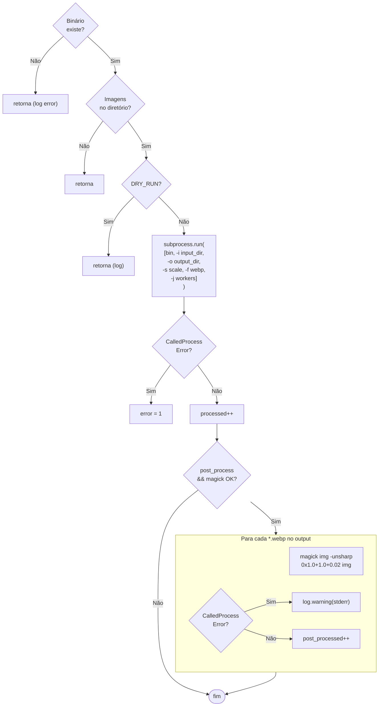

**Stats produzidas:** `processed`, `post_processed`, `error`

---

### 6.7 Step 8 — VideoOptimizer

**Classe:** `VideoOptimizer` · **ID:** `optimize_videos` · **Grupo:** Vídeo & Metadados · **Menu:** 8

Re-encoda vídeos para H.265 (ou H.264) com **ffmpeg**. O modo **smart-skip** usa **ffprobe** para verificar o codec atual e evitar re-encodings desnecessários. Usa `StagingTransaction` para escrita atômica.

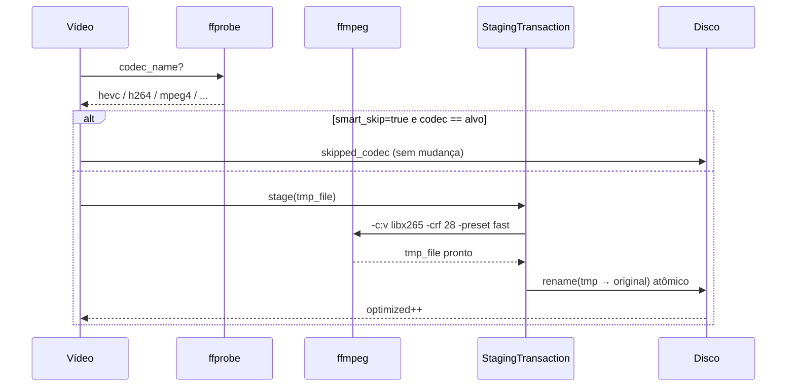

**Controle de oversubscription:** O VideoOptimizer divide os `threads` pela metade — metade como workers Python, metade entregue ao ffmpeg via `-threads N`. Isso evita trashing quando muitos ffmpeg rodam em paralelo.

---

### 6.8 Step 9 — MetadataGenerator

**Classe:** `MetadataGenerator` · **ID:** `generate_metadata` · **Grupo:** Vídeo & Metadados · **Menu:** 9

Gera o `gamelist.xml` no formato EmulationStation combinando ROMs, imagens, vídeos e categorias do `catver.ini`.

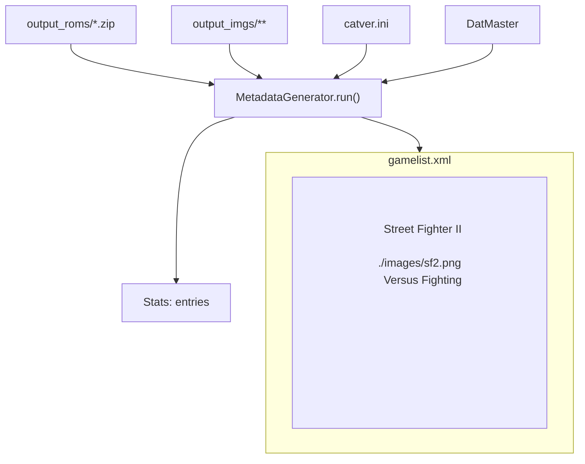

---

### 6.9 Step 10 — KpiReporter

**Classe:** `KpiReporter` · **ID:** `kpi_report` · **Grupo:** Vídeo & Metadados · **Menu:** 10

Mede e reporta uso de disco e contagem de arquivos em todos os diretórios relevantes do projeto. Exporta `kpi.csv` com `csv.writer` (quoting correto para labels com vírgulas).

**Diretórios analisados:** ROMs entrada, ROMs saída, Imagens entrada, Imagens saída, Vídeos.

---

### 6.10 Step 11 — PortsAutomator

**Classe:** `PortsAutomator` · **ID:** `ports_launchers` · **Grupo:** Extras · **Menu:** 11

Gera launchers para ports (jogos Linux nativos ou Windows via Wine). Para cada subdiretório em `ports.source_dir`, detecta o executável principal e cria `autorun.sh` + `game.desktop`.

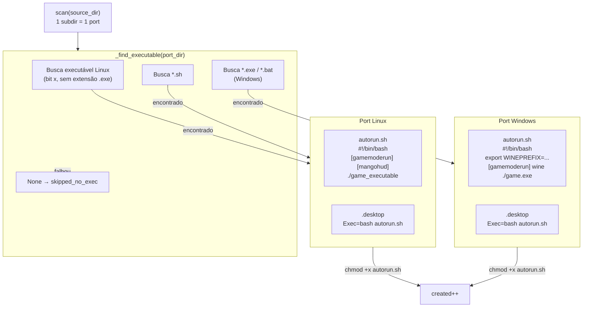

**Wrappers suportados:** `gamemoderun` (CPU governor), `mangohud` (overlay FPS), `wine` / `proton` / `bottles`.

---

### 6.11 Step 12 — OriginalCleaner

**Classe:** `OriginalCleaner` · **ID:** `clean_originals` · **Grupo:** Imagens · **Menu:** 12

> ⚠️ **Operação irreversível** — exclui arquivos PNG/JPG originais. Execute apenas após confirmar que os WebPs estão corretos.

Remove arquivos PNG/JPG **somente se** um `.webp` correspondente de tamanho maior que zero existir no mesmo diretório. Usa `BaseProcessor` com ThreadPool.

---

## 7. Módulos Core

### 7.1 Visão de dependências entre módulos

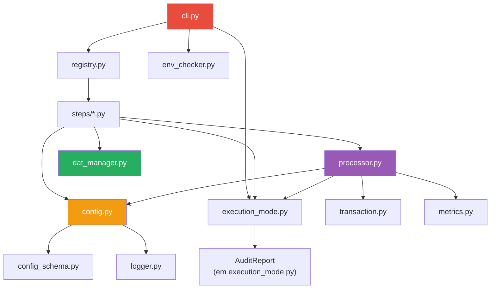

### 7.2 ConfigLoader — Singleton e validação

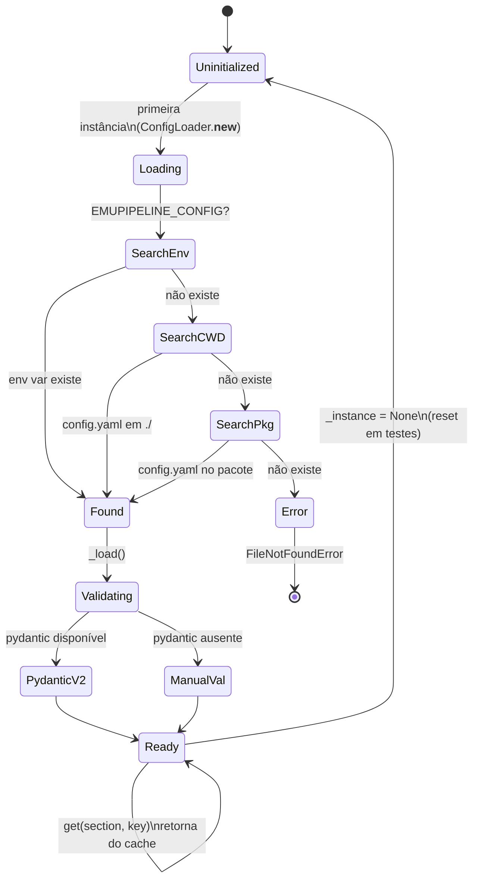

### 7.3 DatMaster — Busca fuzzy de 3 camadas

```mermaid
flowchart TD
    Q["search(filename, threshold)"] --> PREP["Extrai stem:\n'sf2.png' → 'sf2'"]

    PREP --> L1{Layer 1:\nrom_map[stem]}
    L1 -- hit --> R1[("GameInfo\n(exact_rom)")]
    L1 -- miss --> L2

    L2["normalize(stem)"] --> L2C{Layer 2:\ntitle_map[normalized]}
    L2C -- hit --> R2[("GameInfo\n(exact_title)")]
    L2C -- miss --> L3

    L3["bigram_candidates(normalized)\n→ pré-filtra O(1)"] --> SM["SequenceMatcher\nsobre candidatos"]
    SM --> THR{score\n≥ threshold?}
    THR -- Sim --> R3[("GameInfo\n(fuzzy)")]
    THR -- Não --> R4[("None\n(no_match)")]
```

**Hash híbrido do DAT** (para cache):
- Lê 512 KB do início + 64 KB do fim do arquivo
- Detecta adições ao final (frequentes em atualizações do FBNeo)
- Cache pickled com version + fingerprint — invalida automaticamente quando o DAT muda

### 7.4 StagingTransaction — Atomicidade

```mermaid
sequenceDiagram
    participant S as Step
    participant T as StagingTransaction
    participant FS as Sistema de Arquivos

    S->>T: __enter__()
    Note over T: cria tmp_dir em TMPDIR

    loop para cada arquivo
        S->>T: stage(content, dest_path)
        T->>FS: escreve em tmp_dir/hash
    end

    S->>T: commit()
    loop para cada (tmp, dest)
        T->>FS: os.replace(tmp → dest)\n[atômico no mesmo FS]
        Note over T: fallback: shutil.copy2\n+ unlink se cross-FS
    end
    T-->>S: OK

    alt Exceção
        S->>T: __exit__(exc)
        T->>T: rollback()
        T->>FS: rmtree(tmp_dir)
    end
```

### 7.5 ExecutionMode e AuditReport

```mermaid
stateDiagram-v2
    direction LR
    [*] --> NORMAL : padrão
    [*] --> DRY_RUN : --dry-run
    [*] --> AUDIT : --audit

    state NORMAL {
        [*] --> IO_Real
        IO_Real : Leitura + Escrita\nnormais
    }

    state DRY_RUN {
        [*] --> Simula
        Simula : log.debug "would do X"\nZero I/O
    }

    state AUDIT {
        [*] --> Grava
        Grava : AuditReport.record()\nZero I/O de dados
        Grava --> Export : fim do step
        Export : JSON / HTML\n(summary impresso)
    }
```

---

## 8. Modos de Execução

| Modo | Flag CLI | I/O real | Arquivo gerado | Uso |
|---|---|---|---|---|
| `NORMAL` | *(padrão)* | ✅ | — | Produção |
| `DRY_RUN` | `--dry-run` | ❌ | — | Validar antes de executar |
| `AUDIT` | `--audit` | ❌ | `audit_report.json` + `.html` | Revisão de operações destrutivas |

### Injeção de modo nos steps

```python
# CLI instancia cada step com o modo correto
upscaler = Upscaler(mode=ExecutionMode.DRY_RUN)
upscaler.run()
# → nenhum subprocess é chamado, nenhum arquivo criado
```

O modo é passado ao construtor — nunca modificado externamente (sem monkey-patching). Isso garante thread-safety e testabilidade.

---

## 9. CLI — Interface de Linha de Comando

```mermaid
flowchart TD
    START(["emupipeline [options]"]) --> PARSE["argparse\n--config, --dry-run,\n--audit, --pipeline,\n--check-env, --step N"]

    PARSE --> CHECK_ENV{--check-env?}
    CHECK_ENV -- Sim --> ENV_REPORT["EnvironmentChecker.report()\nimprime tabela de deps"]
    CHECK_ENV -- Não --> LOAD_CFG

    LOAD_CFG["ConfigLoader()\n(singleton via env ou CWD)"]

    LOAD_CFG --> PIPE{--pipeline?}
    PIPE -- Sim --> AUTO["get_pipeline_steps()\nordenado por pipeline_order"]
    PIPE -- Não --> STEP{--step N?}
    STEP -- Sim --> ONE["get_by_menu_number(N)"]
    STEP -- Não --> MENU["Menu interativo\n(grupos + numeração)"]

    AUTO & ONE --> EXEC
    MENU -->|"usuário escolhe"| EXEC

    EXEC["Instancia step(mode=mode, audit=audit)\nChama step.run(**kwargs)\nImprime get_stats()"]
```

### Exemplos de uso

```bash
# Pipeline completo em modo real
emupipeline --pipeline

# Simular o pipeline sem modificar nada
emupipeline --pipeline --dry-run

# Auditar apenas a organização de imagens
emupipeline --step 5 --audit

# Usar config alternativo
emupipeline --config /path/to/custom.yaml --pipeline

# Verificar dependências do ambiente
emupipeline --check-env

# Menu interativo
emupipeline
```

---

## 10. Testes

### 10.1 Estrutura de testes

```
tests/
├── conftest.py              # fixtures globais
│   ├── tmp_project          # dirs do projeto em tmp_path
│   ├── sample_dat           # DAT XML mínimo (4 jogos)
│   └── config_factory       # fábrica de config.yaml isolado
├── unit/
│   ├── test_config.py       # ConfigLoader + Pydantic
│   ├── test_dat_manager.py  # DatMaster busca 3 camadas
│   ├── test_execution_mode.py # AuditReport thread-safety
│   ├── test_transaction.py  # StagingTransaction atomicidade
│   └── test_steps/
│       ├── test_organize.py # ImageOrganizer fuzzy match
│       ├── test_upscale.py  # Upscaler subprocess + ImageMagick
│       ├── test_ports.py    # PortsAutomator launchers
│       ├── test_optimize.py # VideoOptimizer smart-skip
│       └── test_dat_split.py
└── integration/
    └── test_pipeline_smoke.py
```

### 10.2 Padrões de teste

```mermaid
flowchart LR
    subgraph FIXTURES["Fixtures (conftest.py)"]
        TMP["tmp_project\ncria estrutura de dirs\nem tmp_path"]
        DAT["sample_dat\nDAT XML com 4 jogos\n(sf2, sf2ce, kof97, mahjong)"]
        CFG["config_factory\ncria config.yaml\nreseta singleton\natualiza cfg_module.cfg"]
    end

    subgraph ISOLAÇÃO["Isolação de Singleton"]
        RST["cfg_module.ConfigLoader._instance = None"]
        NEW["new_cfg = ConfigLoader()\n(lê EMUPIPELINE_CONFIG)"]
        UPD["cfg_module.cfg = new_cfg\n⚠️ crítico: atualiza referência\ndo módulo processor.py"]
    end

    subgraph MOCK["Mocking (unittest.mock)"]
        SP["patch('subprocess.run')\ncontrola chamadas externas"]
        SW["patch('shutil.which')\nsimula presença de magick"]
        BIN["_REAL_BIN = '/usr/bin/false'\n(existe no Linux)"]
    end

    CFG --> ISOLAÇÃO
    MOCK --> TESTS["170+ testes\n✅ passando"]
```

### 10.3 Executar os testes

```bash
# Todos os testes com cobertura
pytest --cov=emupipeline --cov-report=html

# Apenas steps críticos
pytest tests/unit/test_steps/ -v

# Um step específico
pytest tests/unit/test_steps/test_upscale.py -v

# Sem cobertura (mais rápido)
pytest --no-cov -v
```

---

## 11. Troubleshooting

### Diagnóstico rápido

```mermaid
flowchart TD
    ERR["❌ Problema"]

    ERR --> T1{FileNotFoundError\nconfig.yaml}
    T1 --> S1["export EMUPIPELINE_CONFIG=/path/to/config.yaml\nou rode do diretório com config.yaml"]

    ERR --> T2{igir não\nencontrado}
    T2 --> S2["npm install -g igir\nou adicione ao PATH"]

    ERR --> T3{ffmpeg error\nnão converte}
    T3 --> S3["sudo dnf install ffmpeg\nVerifique: ffmpeg -version"]

    ERR --> T4{magick: command\nnot found}
    T4 --> S4["sudo dnf install ImageMagick\nVerifique: magick --version"]

    ERR --> T5{Upscaler:\nbinário não encontrado}
    T5 --> S5["Verifique paths.bin_waifu2x\nou paths.bin_realesrgan em config.yaml"]

    ERR --> T6{Imagens não\nmatched}
    T6 --> S6["Reduza images.fuzzy_threshold\n(ex: 0.70)\nVeja reports/unmatched_images.txt"]
```

### Variáveis de ambiente úteis

| Variável | Uso |
|---|---|
| `EMUPIPELINE_CONFIG` | Caminho alternativo para `config.yaml` |
| `EMUPIPELINE_LOG_LEVEL` | Override de nível de log (DEBUG/INFO/WARNING) |

---

## 12. Glossário

| Termo | Definição |
|---|---|
| **DAT** | Arquivo XML descrevendo ROMs com checksums (CRC/SHA1). Mantido por projetos como FBNeo, MAME, Redump |
| **Driver** | Código emulador de hardware (`sourcefile` no DAT, ex: `capcom/cps1.cpp`) |
| **IGIR** | Ferramenta Node.js para organizar e verificar ROMs contra DATs |
| **Fuzzy match** | Comparação aproximada de strings usando bigramas + SequenceMatcher |
| **Smart-skip** | Verificação do codec atual do vídeo antes de re-encodar |
| **CRF** | Constant Rate Factor — controla qualidade/tamanho no ffmpeg (0=melhor, 51=pior) |
| **Nonmerged** | Modo ROM onde cada jogo tem todos os arquivos necessários independentemente |
| **Symlink relativo** | Link simbólico cujo caminho é relativo ao diretório destino (portável) |
| **StagingTransaction** | Padrão write-to-temp + atomic-rename para evitar arquivos corrompidos |
| **AuditReport** | Registro de operações planejadas sem I/O real (modo AUDIT) |
| **Pipeline order** | Número que define a ordem de execução automática dos steps |
| **Bigram index** | Índice de pares de caracteres para busca fuzzy eficiente |
| **ProcessPool** | Pool de processos separados que bypassam o GIL do Python |
| **Blacklist** | Lista de termos que excluem ROMs (ex: `adult`, `mahjong`) |
| **Clone** | ROM derivado de um parent, com modificações (ex: `sf2ce` cloneof `sf2`) |
| **gamelist.xml** | Formato de metadados do EmulationStation para frontend de emulação |
| **Oversubscription** | Excesso de threads/processos causando degradação de desempenho |

---

## Contribuindo

```bash
# Setup de desenvolvimento
pip install -e ".[all]"
pre-commit install

# Rodar testes antes de commitar
pytest --no-cov -v

# Verificar formatação
ruff check src/ tests/
```

Pull requests são bem-vindos. Veja [CONTRIBUTING.md](CONTRIBUTING.md) para o guia completo.

---

<div align="center">

**EmuPipeline v5.0** — feito com ❤️ para a comunidade de emulação

[Issues](https://github.com/rtasistemas/evs/issues) · [Releases](https://github.com/rtasistemas/evs/releases) · [CHANGELOG](CHANGELOG.md)

</div>
